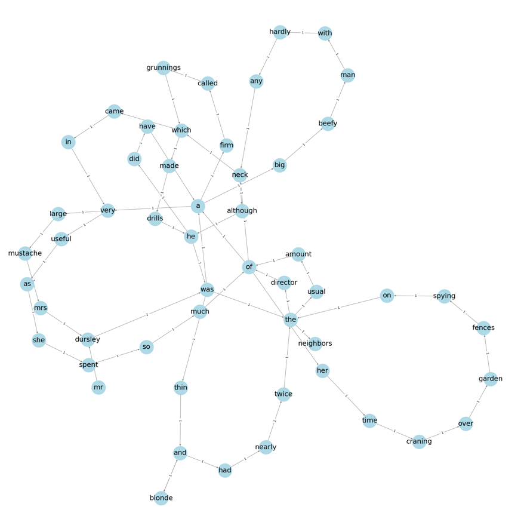

# Text Analysis and Random Walk

## 项目描述

这个项目是一个文本分析和随机漫步的应用，使用Python和Streamlit框架开发。主要功能包括显示文本图形、生成新文本、查询桥接词、显示最短路径和随机漫步。

## 项目结构

- `Graph.py`: 包含`TextGraph`类，用于处理文本、构建图形、查询桥接词、计算最短路径和执行随机漫步。
- `Graph-app.py`: Streamlit应用的主文件，包含用户界面和交互逻辑。
- `text.txt`:保存建图的文本。
- `requirements.txt`: 项目依赖。
- `SoftwareEngineering.yaml`: conda环境文件。
- `Random_walk`: 保存随机漫步的结果。
- `README.md`: 项目说明文件。
- `Graph.png`: 建立的文本图形。

## 如何运行

1. 确保已经安装Python和pip。
2. 安装项目依赖：

```bash
pip install -r requirements.txt
```
或者也可以使用conda创建虚拟环境安装依赖：
```bash
conda env create -f SoftwareEngineering.yaml
```
3. 运行Streamlit应用：

```bash
streamlit run code/Graph-app.py
```

## 功能介绍

- **显示图形**：显示文本图形，节点为单词，边为单词之间的关系。
- 
- **生成新文本**：在用户输入的文本中，每两个单词之间插入一个桥接词，生成新的文本。
- 
- **查询桥接词**：查询两个单词之间的所有桥接词,同步显示有向图中桥接词的位置。
- 
- **显示最短路径**：计算并显示两个单词之间的所有最短路径。
- 
- **随机漫步**：在图中进行随机漫步，从一个随机节点开始，然后随机选择一个邻居节点，直到没有可选择的邻居节点为止。
- 
## 开发者

Yzweak & Lixian Dai

## 版权信息

本项目采用MIT许可证，详情请见LICENSE文件。